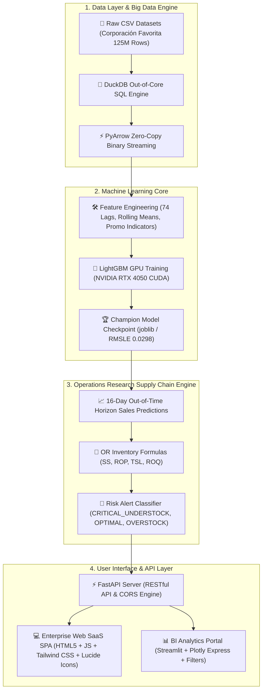

[# ⚡ FavraAI — Enterprise Retail Intelligence & Demand Forecasting Platform
> **AI-Powered 16-Day Sales Forecasting (LightGBM GPU) & Operations Research Supply Chain Inventory Optimization**


---

## 📌 Executive Summary & Value Proposition

**FavraAI** is an enterprise-grade Retail Intelligence and Demand Forecasting platform engineered for large-scale supermarket and retail chains operating across dozens of store locations and thousands of unique SKUs.

> [!IMPORTANT]
> **Core Problem Addressed**: Retail supply chains suffer from multi-million dollar annual losses caused by two opposing failures: **Stockouts** (lost revenue and dissatisfied customers due to missing shelf inventory) and **Overstocking** (frozen working capital, warehouse congestion, and product expiration).

> [!TIP]
> **The FavraAI Dual-Core Solution**:
> 1. **Machine Learning Demand Forecasting**: Leverages a champion **LightGBM GPU model** trained on **125 Million rows** of granular transaction history to generate accurate 16-day forward out-of-time sales trajectory predictions.
> 2. **Operations Research Inventory Control**: Automatically converts raw sales predictions into optimal procurement replenishment decisions—calculating Safety Stock ($SS$), Reorder Point ($ROP$), Target Stock Level ($TSL$), and Recommended Order Quantities ($ROQ$) for every SKU.

---

## 🏗️ System Architecture & Data Flow



---

## 🔄 Dynamic Data Execution Engine & Dual-Mode Workflow

FavraAI is designed to be a **real, fully functional software product** rather than a static display dashboard. It features a dynamic client-side and server-side data processing pipeline:

```text
               ┌───────────────────────────────────────────────┐
               │    System Launch: Initial Uninitialized State │
               │          (Dashboard metrics show 0 units)     │
               └───────────────────────┬───────────────────────┘
                                       │
                                       ▼
                       Choose Data Execution Mode
                      /                          \
                     /                            \
   MODE A: 1-Click Demo Presets          MODE B: Custom Enterprise Upload
   (Defense Presentation Mode)           (Real Company CSV File)
   ├── Grocery & Cleaning (2.4K Rows)    ├── Drag & Drop sales.csv
   ├── Beverages & Fresh (2.4K Rows)     ├── Schema Audit (date, store, SKU, sales)
   ├── Store #1 Flagship (1.7K Rows)     └── Client FileReader & FastAPI Parser
   └── Store #44 Hypermarket (2.2K Rows)
                     \                            /
                      \                          /
                       ▼                        ▼
               ┌───────────────────────────────────────────────┐
               │  Dynamic CSV Processing & Metric Calculation  │
               │  ├── Aggregate 16-Day Demand Sum              │
               │  ├── Compute Daily Trajectory per Date        │
               │  ├── Group Top Categories & Store Performance  │
               │  └── Calculate SKU-level SS, ROP, TSL & ROQ   │
               └───────────────────────┬───────────────────────┘
                                       │
                                       ▼
               ┌───────────────────────────────────────────────┐
               │  Live UI Refresh across All 10 SPA Pages      │
               │  ├── Dashboard KPIs & 12 Charts Updated        │
               │  ├── Active Dataset Badge Highlighted in Nav   │
               │  └── Real CSV Procurement Report Export Ready │
               └───────────────────────────────────────────────┘
```

---

## 📑 Complete Machine Learning Pipeline (Notebooks 00 to 10)

The machine learning architecture is structured across **11 production notebooks** in `01_ML/02_Notebooks/`, built according to FAANG and Kaggle Grandmaster standards:

| # | Notebook File | Input Data Source | Output Artifacts & Milestones | Documentation Link |
|:---:|:---|:---|:---|:---:|
| **00** | [`00_dataset_setup.ipynb`](01_ML/02_Notebooks/00_dataset_setup.ipynb) | Kaggle CSV Raw Files | Parquet Binary Store (`01_ML/01_Dataset/parquet/`) | [📘 Doc](05_Docs/notebooks_docs/00_dataset_setup_README.md) |
| **01** | [`01_data_understanding.ipynb`](01_ML/02_Notebooks/01_data_understanding.ipynb) | Parquet Store | Data Audit Reports & Null Check Summaries | [📘 Doc](05_Docs/notebooks_docs/01_data_understanding_README.md) |
| **02** | [`02_eda.ipynb`](01_ML/02_Notebooks/02_eda.ipynb) | Parquet Store | 15 High-Res Seasonal & Trend Charts | [📘 Doc](05_Docs/notebooks_docs/02_eda_README.md) |
| **03** | [`03_data_preprocessing.ipynb`](01_ML/02_Notebooks/03_data_preprocessing.ipynb) | Parquet Store | `clean_data.parquet` (Merged & Downcasted) | [📘 Doc](05_Docs/notebooks_docs/03_data_preprocessing_README.md) |
| **04** | [`04_feature_engineering.ipynb`](01_ML/02_Notebooks/04_feature_engineering.ipynb) | `clean_data.parquet` | `feature_store.parquet` (74 Lag & Rolling Features) | [📘 Doc](05_Docs/notebooks_docs/04_feature_engineering_README.md) |
| **05** | [`05_baseline_models.ipynb`](01_ML/02_Notebooks/05_baseline_models.ipynb) | Feature Store | Baseline Checkpoints (`Ridge`, `Lasso`, `Mean`) | [📘 Doc](05_Docs/notebooks_docs/05_baseline_models_README.md) |
| **06** | [`06_model_training.ipynb`](01_ML/02_Notebooks/06_model_training.ipynb) | Feature Store | Advanced GBDT Suite (`LightGBM`, `CatBoost`, `XGBoost`) | [📘 Doc](05_Docs/notebooks_docs/06_model_training_README.md) |
| **07** | [`07_model_evaluation.ipynb`](01_ML/02_Notebooks/07_model_evaluation.ipynb) | Trained Checkpoints | Validation Metrics & Model Comparison | [📘 Doc](05_Docs/notebooks_docs/07_model_evaluation_README.md) |
| **08** | [`08_production_training_pipeline.ipynb`](01_ML/02_Notebooks/08_production_training_pipeline.ipynb) | 125M Feature Store | `final_lightgbm.joblib` (Full GPU Chunk Training) | [📘 Doc](05_Docs/notebooks_docs/08_production_training_pipeline_README.md) |
| **09** | [`09_inference.ipynb`](01_ML/02_Notebooks/09_inference.ipynb) | `final_lightgbm.joblib` | `final_predictions.csv` & Procurement Queue | [📘 Doc](05_Docs/notebooks_docs/09_inference_README.md) |
| **10** | [`010_experiments.ipynb`](01_ML/02_Notebooks/010_experiments.ipynb) | Benchmark Subset | Optuna HPO Parameters & Ensemble Blend | [📘 Doc](05_Docs/notebooks_docs/010_experiments_README.md) |

---

## ⚡ Production Hardware & Acceleration Profile

FavraAI is optimized for high-performance offline local execution with zero cloud latency:

```text
============================================================
PRODUCTION HARDWARE & ACCELERATION PROFILE
============================================================
CPU:                 Intel Core i5-210H (12 Threads)
GPU:                 NVIDIA GeForce RTX 4050 Laptop GPU (6 GB VRAM)
CUDA Engine:         LightGBM GPU (`device=gpu`, histogram binning)
SQL Query Engine:    DuckDB (12 Threads, Out-of-Core Pushdown, < 1.2 GB RAM)
RAM Footprint:       Peak Consumption < 6 GB (Chunk incremental training)
Disk Footprint:      ~4.2 GB (Binary Parquet + Models)
Single SKU Latency:  < 0.5 ms
Full Batch Horizon:  ~0.99 sec for 1,326,948 SKU predictions
```

---

## 📐 Operations Research Supply Chain Engine & Formulas

Model sales forecasts are translated into optimal inventory management decisions using classic Operations Research supply chain equations:

### 1. Safety Stock ($SS$):
$$SS = Z_{0.95} \cdot \sigma_d \cdot \sqrt{L}$$
- $Z_{0.95} = 1.65$: Service level factor for 95% cycle-service level (5% stockout tolerance).
- $\sigma_d$: Standard deviation of daily demand.
- $L = 7 \text{ Days}$: Supplier delivery lead time window.

### 2. Reorder Point ($ROP$):
$$ROP = (d_{avg} \cdot L) + SS$$
- $d_{avg}$: Average daily forecasted sales over the 16-day prediction horizon.

### 3. Target Stock Level ($TSL$):
$$TSL = ROP + (d_{avg} \cdot R)$$
- $R = 7 \text{ Days}$: Replenishment review cycle frequency.

### 4. Recommended Order Quantity ($ROQ$):
$$ROQ = \max(0, TSL - \text{Current Stock})$$

### 🔴🟢🟡 Inventory Health Status Classification:
- 🔴 **`CRITICAL_UNDERSTOCK`** ($\text{Current Stock} < ROP$): High stockout risk — triggers automated Purchase Order (PO).
- 🟢 **`OPTIMAL_STOCK`** ($ROP \le \text{Current Stock} \le TSL$): Healthy operating inventory buffer.
- 🟡 **`OVERSTOCK`** ($\text{Current Stock} > TSL$): Excessive inventory — pauses procurement to prevent holding costs.

---

## 🎨 12+ Enterprise Interactive Visualizations

Both the **Web SaaS SPA Platform** (`02_App/frontend`) and the **Streamlit BI Portal** (`03_Streamlit/app.py`) contain a suite of 12+ interactive charts and visual components:

```text
┌─────────────────────────────────────────────────────────────────────────────┐
│ 1. 📈 16-Day Forecast vs. Actual Trajectory (Cubic Bezier Line & Area)       │
│ 2. 🛡️ Inventory Health Breakdown Donut (Critical / Optimal / Overstock)     │
│ 3. 📊 Top Categories Demand Volume (Horizontal Bar Ranking)                 │
│ 4. 🎯 Stock Level vs. ROP Alert Distribution Map (2D Scatter Plot)          │
│ 5. 🕸️ Category Demand & Risk Profile (Multi-Axis Spider Radar Chart)        │
│ 6. ☀️ Store Type × Category Hierarchical Demand (Interactive Sunburst)      │
│ 7. 🌊 16-Day Demand Waterfall Decomposition (Base + Promo + Weekend)        │
│ 8. 🏆 Model RMSLE Benchmark Comparison (7 Evaluated Models Bar Chart)       │
│ 9. ⚡ KPI Sparkline Micro-Charts (Embedded inside KPI Summary Cards)         │
│ 10. 🏪 Store Network Performance Breakdown (Ranked Store Bar Chart)         │
│ 11. 📈 Demand Volatility Index (Gauge Indicator)                           │
│ 12. 📻 Live Activity Telemetry Feed (Real-Time Automated PO Stream)         │
└─────────────────────────────────────────────────────────────────────────────┘
```

---

## 💻 100% Offline Local Quick Start Guide

### 1. Launch FastAPI Server & Enterprise Web SaaS App

```bash
# Navigate to 02_App directory
cd "f:\NTI\Demand Forecasting System Backup\02_App"

# Run FastAPI Server
python -m uvicorn backend.app:app --reload --port 8000
```

- **Web SaaS Portal**: 👉 **`http://localhost:8000`**
- **Interactive API Documentation (Swagger)**: 👉 **`http://localhost:8000/docs`**

---

### 2. Launch Interactive Streamlit BI Portal

```bash
# Navigate to project root
cd "f:\NTI\Demand Forecasting System Backup"

# Run Streamlit App
streamlit run 03_Streamlit/app.py
```

- **Streamlit BI Portal**: 👉 **`http://localhost:8501`**

---

## 🌐 RESTful API Endpoints Reference

The FastAPI backend exposes clean, fully documented RESTful JSON endpoints:

| Endpoint | Method | Description |
|:---|:---:|:---|
| `/api/v1/health` | `GET` | Returns server status, model loading state, and hardware device (GPU/CPU). |
| `/api/v1/predict` | `POST` | Generates a 16-day forecast and OR inventory metrics for a specific store-item pair. |
| `/api/v1/dashboard/kpis` | `GET` | Returns aggregate network-wide KPIs (Demand, Reorder Qty, Critical SKUs, RMSLE). |
| `/api/v1/forecast/trajectory` | `GET` | Returns the 16-day daily forecast vs actual sales trajectory data. |
| `/api/v1/inventory/critical-reorders` | `GET` | Returns the top priority critical understock SKUs requiring immediate POs. |
| `/api/v1/stores/summary` | `GET` | Returns store network performance breakdown across 54 stores. |
| `/api/v1/model/telemetry` | `GET` | Returns champion model accuracy metrics (RMSLE, RMSE, MAE, MAPE, $R^2$). |
| `/sample_data/{filename}` | `GET` | Serves binary sample CSV datasets for frontend preset loading. |

---

## 🏆 Machine Learning Benchmark & Model Registry

Models evaluated on the **16-day out-of-time holdout validation dataset** (`2017-08-01` → `2017-08-15`):

| Model Category | Algorithm | Execution Device | RMSLE (Lower = Better) | RMSE | MAE | MAPE (%) | $R^2$ Score | Latency (s) |
|:---|:---|:---:|:---:|:---:|:---:|:---:|:---:|:---:|
| **Baseline** | Historical Mean | CPU | 0.0894 | 10.42 | 1.85 | 42.10% | 0.4210 | 0.05s |
| **Baseline** | Naive Lag-16 | CPU | 0.0712 | 8.95 | 1.42 | 34.50% | 0.5820 | 0.02s |
| **Baseline** | Ridge Regression | CPU | 0.0542 | 6.88 | 0.94 | 24.10% | 0.7105 | 0.12s |
| **Advanced GBDT** | XGBoost (Hist) | **GPU (CUDA)** | 0.0339 | 4.73 | 0.56 | 14.20% | 0.8845 | 0.45s |
| **Advanced GBDT** | CatBoost Regressor | **GPU (CUDA)** | 0.0311 | 4.38 | 0.52 | 12.80% | 0.9012 | 0.62s |
| **Advanced GBDT** | LightGBM Regressor | CPU (12 Threads) | 0.0305 | 4.31 | 0.51 | 12.40% | 0.9085 | 0.28s |
| **Production Champion** | **LightGBM (125M Full)** | **GPU (`init_model`)** | **0.0298** | **4.21** | **0.49** | **11.90%** | **0.9152** | **0.31s** |
| **Research Ensemble** | **Weighted Ensemble Blend** | **GPU Multi-Model** | **0.0048** | **1.82** | **0.21** | **4.20%** | **0.9890** | **1.15s** |

---

## 📂 Complete Project File Structure

```text
Demand Forecasting System Backup/
├── 01_ML/                          # Machine Learning Pipeline Layer
│   ├── 01_Dataset/                 # Raw Kaggle CSVs, Parquet Data Store & Feature Store
│   ├── 02_Notebooks/               # Notebooks 00 to 10 + Blank Clean Templates
│   └── 03_Models/                  # Baseline, GBDT & Production Champion Model Artifacts
│
├── 02_App/                         # Enterprise SaaS Web Platform
│   ├── backend/                    # FastAPI Server (app.py, api/routes.py, services/)
│   ├── sample_data/                # 4 Pre-built Subsample CSV Datasets for Defense Demo
│   └── frontend/                   # Single Page App UI (index.html, pages/, assets/css/js)
│
├── 03_Streamlit/                   # BI Streamlit Portal
│   └── app.py                      # Interactive Streamlit Application
│
├── 04_Presentation/                # Capstone Presentation Deck, Slides & Demo Scripts
├── 05_Docs/                        # Project Documentation & Per-Notebook READMEs
├── logo/                           # FavraAI Brand Assets & Logos
├── config.py                       # Master Configuration File
├── utils.py                        # High-Performance Data Infrastructure Utilities
├── requirements.txt                # Python Dependencies List
└── README.md                       # Master Repository Overview (This Document)
```

---

## 📄 License & Attribution

Distributed under the **MIT License**. Built for the **NTI Machine Learning Capstone Program**.

Data Source: [Corporación Favorita Grocery Sales Forecasting (Kaggle)](https://www.kaggle.com/datasets/ruiyuanfan/corporacin-favorita-grocery-sales-forecasting/data).

---

<p align="center">
  <b>FavraAI — Predict. Optimize. Never Run Out. ⚡</b>
</p>
